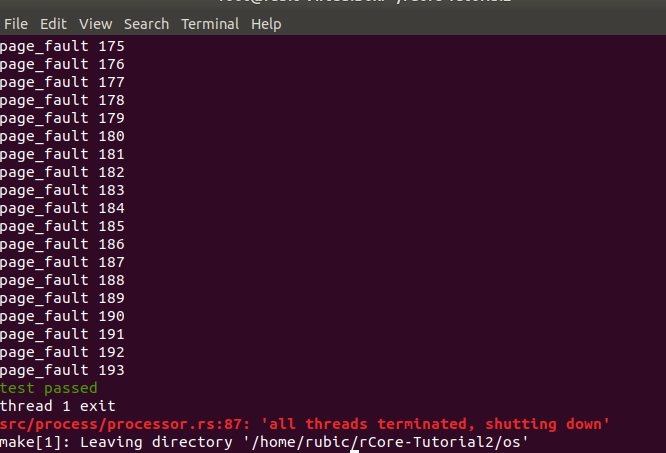
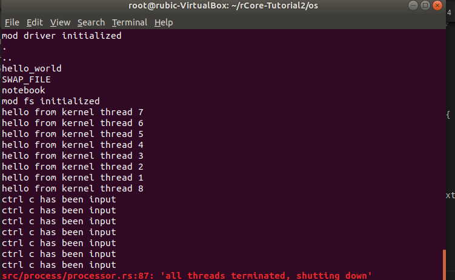

## lab0

`https://rcore-os.github.io/rCore-Tutorial-deploy/docs/lab-0/guide/intro.html`

1. 简便起见，将panic的处理策略改成`abort` , 直接调用panic_handler而不是先堆栈展开再调用

   在Cargo.toml 中加上两行代码：

   ​	os/Cargo.toml

   ```toml
   ...
   
   # panic 时直接终止，因为我们没有实现堆栈展开的功能
   [profile.dev]
   panic = "abort"
   
   [profile.release]
   panic = "abort"
   ```

2. main.rs中要加的两个标签如下

   ```rust
	#![no_std]	//禁用std
	//为何要禁用std？裸机环境，没有std
	#[panic_handler]	//声明panic处理函数 如：
	fn panic(_info: &PanicInfo)-> !{
	    loop{}
	}

   ```

3. 为何不用main函数？而是_start()函数？

   main函数不是第一个运行的函数，_strat函数是的。

   ```rust
   /// 覆盖 crt0 中的 _start 函数
   /// 我们暂时将它的实现为一个死循环
   #[no_mangle]
   pub extern "C" fn _start() -> ! {
       loop ={}
   }
   ```

4. 如何编译成裸机目标（用不了std

   ```cargo build --target riscv64imac-unknown-none-elf```  其中"none"表示没有操作系统（裸机）

   也可以在.cargo/config中加入

   os/.cargo/config

   ```toml
   # 编译的目标平台
   [build]
   target = "riscv64imac-unknown-none-elf"
   ```

5. 查看汇编码：

   ```rust
   rust-objdump target/riscv64imac-unknown-none-elf/debug/os -x --arch-name=riscv64
   -x查看源信息
   -d查看反汇编
   ```

   生成镜像：

   `rust-objcopy target/riscv64imac-unknown-none-elf/debug/os --strip-all -O binary target/riscv64imac-unknown-none-elf/debug/kernel.bin`

   


## lab1

​	`https://rcore-os.github.io/rCore-Tutorial-deploy/docs/lab-1/guide/intro.html`

### 	习题：

#### 		执行ebreak指令的时候，sp是如何变化的？

​			硬件指令并没有对sp进行操作

​			观察代码可知，sp首先向下生长，给context留下足够的空间。

​			这个时候sp的值可以作为context的地址

> ​			虽然栈是从上往下生长，但是数组/结构体寻址则是基地址加上偏移量，所以sp可以作为context的地址。

​			从`_interrupt`里跳到`handle_interrupt`里时并没有改变sp的值。（jal指令）

​			在`handle_interrupt`里调用了`breakpoint`函数，这时有新的参数入栈和出栈

​			`handle_interrupt`函数调用完成之后继续执行interrupt.asm的代码

> `rust`函数不带`return`语句，也没有看到ret指令，这里这个函数调用过程有些不懂

​			然后pc回到`jal handle_interrupt`的下一行，继续执行，这里不加restore标签应该也是可以的，在resotre中，sp恢复到来之前的值。

#### 		main.rs去除panic!会如何？

​			在我的代码中运行的结果是出现了一个非ebreak并且非time_break的中断

​			看了答案了解了代码会继续往下运行，很容易就出线非法访问。

#### 		代码题：

​			第一问，显然，见代码

​			第二问，经过查文档，stval可以在地址例外中保存出错的地址，所以只需要读取这个寄存器的值就可以判断了。要读这个寄存器，只能用csrr指令。

> 我看漏了一个东西，这里handle_interrupt已经获取了stval并且把它当成参数传入了

​			第三问，可以在entry.asm `sret`之前把执行`ld t1 (x0)`指令

​	目前存在的问题

​				1. 为何handler.rs没有use console就可以使用println!

## lab2

​	这个lab最终目的是为了完成一个物理页帧分配系统，由于内核在进行这些工作时需要一个堆，但是OS并没有提前实现这个堆，所以我们手动实现它。并且这个堆是用的现有的轮子。剩下的部分都是为了完成一个物理内存管理的模块这个模块的管理器是FRAME_ALLOCTOR。

   	1.  .bss字段是存放初始值为0的值的内存空间。并且这里实现的是**内核堆**，它仅仅需要一块空间来存放。我认为，如果用户进程需要堆的话，可能会对其单独分配一块空间作为堆。
 	2.  经过验证，这个trait在`StackedAllocator` 中具体实现，其时间复杂度为O(1)  （执行了一次 `vec.push()`  其空间复杂度为O(n)
 	3.  代码题见lab2/src(线段树)

## lab3

### 	修改内核：

​			boot_page_table标签后面存的其实是一堆VPN3的页表项，一个代表1GB的内存空间

​			所以第三个表示的是2G-3G的虚拟内存空间，也就是0x8000_0000

### 	题目：

#### 		1. 

​		**a.** boot_page_table标签后面存的其实是一堆VPN3的页表项，一个代表1GB的内存空间

```asm
_start:
    # 通过线性映射关系计算 boot_page_table 的物理页号
    # 在linker.ld里把整个文件放到了0xffffffff80200000开始的虚拟地址中
    # 同时这里也是入口地址（_start）
    # open SBI把这段代码放到了0x80200000这个物理地址上
    lui t0, %hi(boot_page_table)
    li t1, 0xffffffff00000000
    sub t0, t0, t1
    srli t0, t0, 12 #右移
    # 8 << 60 是 satp 中使用 Sv39 模式的记号
    li t1, (8 << 60)
    or t0, t0, t1
    # 写入 satp 并更新 TLB
    csrw satp, t0
    sfence.vma
```

​		**b.** 跳到rust_main时，把该函数的虚拟地址赋值给了PC，通过第510项页表入口，读取到其物理页号（因为该项是一个叶节点，所以获取物理页号之后直接跟后面三十位地址拼成物理地址）

#### 	2. 

​		`page_tables`里面存的是已经分配了的页表的信息，`page_tables[i]`里面放的是第i个分配的帧的基址（这个帧里存的是页表）

​		`mapped_pairs`存的是

#### 	3.

​		不需要访问B

​		可以通过引用来访问B，参考下图中第六到第八行注释

#### 	4. 提问：rcore是如何设置页表的？

​		`Mapping::new()`这个函数返回的是物理地址的信息

```rust
/// 找到给定虚拟页号的三级页表项
///
/// 如果找不到对应的页表项，则会相应创建页表
pub fn find_entry(&mut self, vpn: VirtualPageNumber) -> MemoryResult<&mut PageTableEntry> {
    // 从根页表开始向下查询
    // 这里不用 self.page_tables[0] 避免后面产生 borrow-check 冲突（我太菜了）
    let root_table: &mut PageTable = PhysicalAddress::from(self.root_ppn).deref_kernel();
    let mut entry = &mut root_table.entries[vpn.levels()[0]];
    //vpn.levels()[0]  vpn的第一级页号
    //root_table.entries：一个4KB的数组，用虚拟地址索引
    //这个时候entry用引用来访问vpn的第一级页表
    for vpn_slice in &vpn.levels()[1..] {
        if entry.is_empty() {
            // 如果页表不存在，则需要分配一个新的页表
            let new_table = PageTableTracker::new(FRAME_ALLOCATOR.lock().alloc()?);
            let new_ppn = new_table.page_number();
            // 将新页表的页号写入当前的页表项
            *entry = PageTableEntry::new(Some(new_ppn), Flags::VALID);
            // 保存页表
            self.page_tables.push(new_table);
        }
        // 进入下一级页表（使用偏移量来访问物理地址）
        //这里entry还是用引用来访问下一级页表
        entry = &mut entry.get_next_table().entries[*vpn_slice];
    }
    // 此时 entry 位于第三级页表
    Ok(entry)
}
```

#### 代码题：

​	见swapper.rs



## lab4-1

### 	1.原理：

​		**线程切换之中，页表是何时切换的？页表的切换会不会影响程序 / 操作系统的运行？为什么？**

​		线程切换是在Thread::prepare中进行的，

​			通过调用内核栈的push_context 将context放到栈顶

​			然后prepare返回，这个时候PC就从context中读取返回地址。

​	页表是在thread::prepare中进行切换的，这个时候并不会影响程序运行，因为内核空间在任何线程中都是相同的

### 	2.设计

​		**如果不使用 `sscratch` 提供内核栈，而是像原来一样，遇到中断就直接将上下文压栈，请举出（思路即可，无需代码）**	

​		如果内核跟用户进程用一个栈，那么意味着他们可以共同访问这一块地址空间。那整个异常处理的逻辑都要重写，下面几种情况都是可能发生的。具体发生原因视实现方案不同。

- ​	   一种情况不会出现问题

  ​		普通的函数调用是可以的

  - 一种情况导致异常无法处理（指无法进入 `handle_interrupt`）
  - 一种情况导致产生嵌套异常（指第二个异常能够进行到调用 `handle_interrupt`，不考虑后续执行情况）
  - 一种情况导致一个用户进程（先不考虑是怎么来的）可以将自己变为内核进程，或以内核态执行自己的代码
  

### 3.代码题

#### 	1.1

​		我在main函数里面加了一个死循环，所以可以有充分的时间用来调用中断

​		结果如下，实现见interrupt/handler.rs

​		

#### 1.2

​	结果如下，实现见handler、thread

​	

## lab4-2

​	这一个我本来想用rust自带的binaryheap实现的，结果快写完了才发现binaryheap只能对堆顶进行操作。不能实现remove，可惜。由于赶ddl 就先用linkedlist实现吧

​	rust不用允许整数计算溢出，这里写的stride有一个潜在的bug，等有时间再修改。实验截图如下，**如果不加painc！可以持续运行一段时间**  时间比较仓促，暂时先完成这样。


 **分析：**

- 在 Stride Scheduling 算法下，如果一个线程进入了一段时间的等待（例如等待输入，此时它不会被运行），会发生什么？

     因为他的pass比较小，所以会继续运行而没人抢占

- 对于两个优先级分别为 9 和 1 的线程，连续 10 个时间片中，前者的运行次数一定更多吗？

    不一定，优先级为9的线程可能先运行完毕

- 你认为 Stride Scheduling 算法有什么不合理之处？可以怎样改进？

  ​	1. 我自己写的并不能对溢出的情况进行处理。后期完善的时候可以增加一个模运算。

  ​	2. 我的实现中，如果加进来一个新的线程，它的pass是0，所以会连续执行一段时间。可以把初始的步数设成当前队列中“无符号的有符号语义下的比较”最小的那个pass